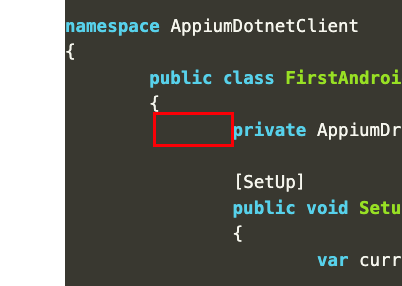
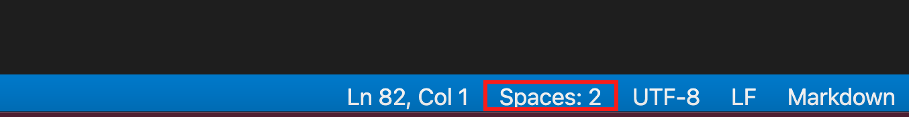
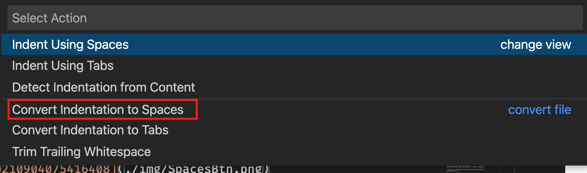

## Background
Setting up blog using Github pages and Jekyll

<br/>

## Installation:
* Pick a Jekyll theme from :  <https://jekyllthemes.io/>
* Fork the repo:  <https://github.com/StartBootstrap/startbootstrap-clean-blog>
* Change the name of the forked repo to `yourgithubhandle.github.io`
* Pull repo down to run locally (ref: <https://jekyllrb.com/>)
  * Install Jekyll on local machine: `gem install jekyll bundler`
  * From the cloned github repo, run:  `bundle install` to restore project
  * Start jekyll server: `bundle exec jekyll serve` 

* Clean up:
  * Update `_config.yml` file with your details and delete unrelated content.
  * Delete all default post from `_posts.` folder.
  

<br/>

## Write Post
* From `_posts/` folder, add mardown file following `year/month/date/post-title` convention
* Add the following details to top of the markdown file:
```
---
layout: post
title: "Setup Github pages with Jekyll"
subtitle: "because they are awesome"
date: '2021-08-22 17:06:15'
background: '/img/bg-about.jpg'
---
```
<br/>

## Custom syntax highlighting with css file.
Make sure `kramdown` and `rouge` are installed
```zsh
gem install kramdown rouge
```
Add these to `_config.yml` file 
```yml
markdown: kramdown
highlighter: rouge
```


Download a `css` stylesheet that you like.  

I'm using [monokai.css](https://gist.github.com/DarkSector/49e4e0e5e962c5342432)

Add `monokai.css` file to `assets` folder (the assets folder on same level woth _posts folder)

Run this command to copy `monokai.css` to `_site\assets\` folder
```zsh
rougify style monokai > assets/monokai.css
```

Open `head.html` and add link to `monokai.css` right below `main.css`
```html
<link rel="stylesheet" href="{{"/assets/main.css" | relative_url }}">
<link rel="stylesheet" href="{{"/assets/monokai.css" | relative_url }}">
```

<br/>

## Fix code highlighting indentation
Code indentation might be display as 8 spaces. Example:



To fix this, use VSCode and `Convert Indentation to Spaces`



